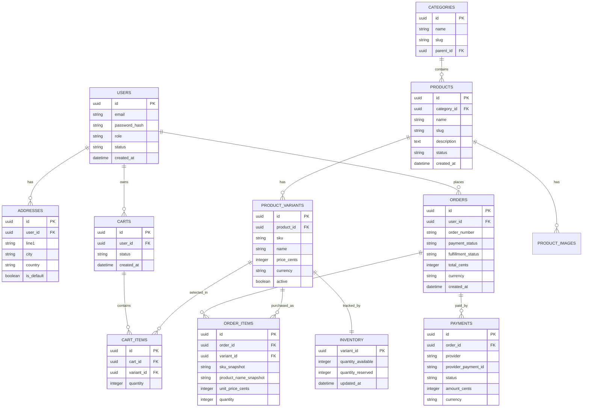
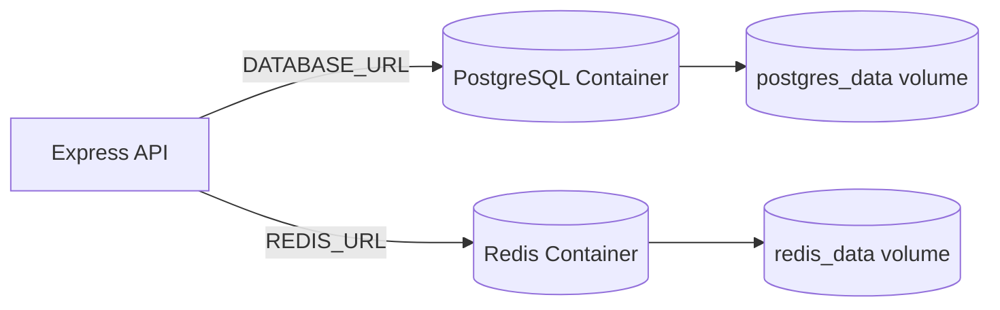

# E-Commerce Database Design

## Recommended Database

Use a relational database such as PostgreSQL.

Reason: e-commerce needs transactions, constraints, relationships, and reliable reporting. Product catalogs can look document-like, but checkout, orders, payments, and inventory are strongly relational.

## Core Entity Relationship Diagram

This is the first relational model for the PostgreSQL database. Redis is not
shown here because it is a cache, not the source of truth for business records.



The major boxes represent durable database tables. Relationship arrows show
foreign-key ownership: for example, one user can own many carts and place many
orders, while each cart item points to the product variant the customer selected.
The important design choice is that orders store snapshots of product names,
SKUs, and prices so order history remains correct even if catalog data changes.

## Initial Local Infrastructure

The first local infrastructure uses two Docker containers:

- PostgreSQL stores durable application tables: users, catalog, carts, orders,
  payments, and inventory.
- Redis stores cache data that can be rebuilt, such as hot product listings or
  short-lived session/cache entries later.



The API connects to Postgres through `DATABASE_URL` and Redis through
`REDIS_URL`. Postgres is the source of truth. Redis should only hold data the
system can recompute or safely expire. The volumes persist local container data
between restarts.

Docker Compose commands:

```bash
npm run db:start
npm run db:health
npm run db:stop
npm run db:down
```

## Important Tables

### users

Stores customer, admin, and support accounts. Use a role field for the MVP. If permissions become complex, introduce a separate permissions model later.

### products

Represents the public product concept. Do not put stock here if the product has variants.

### product_variants

Represents the purchasable item. Cart items and order items should point to variants.

Example: "T-Shirt" is a product. "T-Shirt, black, medium" is a variant.

### inventory

Tracks stock by variant. Keep stock updates atomic.

### carts and cart_items

The cart is temporary and can change. It should not be treated as a financial record.

### orders and order_items

Orders are durable business records. Store snapshots because catalog data can change after purchase.

### payments

Stores payment provider references and status. Do not store raw card data.

## Index Recommendations

Start with:

- `users.email` unique index.
- `products.slug` unique index.
- `product_variants.sku` unique index.
- `products.category_id` index.
- `orders.user_id` index.
- `orders.order_number` unique index.
- `payments.provider_payment_id` unique index.
- `cart_items.cart_id` index.
- `cart_items.variant_id` index.

## Transaction Example: Checkout

At checkout, the backend should:

1. Load the active cart.
2. Validate all variants are active.
3. Recalculate prices from the database.
4. Validate stock.
5. Create a pending order.
6. Create order item snapshots.
7. Create or initiate payment.
8. Mark cart as checked out only after the order is created.

For inventory, use an atomic update pattern:

```sql
UPDATE inventory
SET quantity_available = quantity_available - :quantity
WHERE variant_id = :variant_id
  AND quantity_available >= :quantity;
```

If the affected row count is zero, there was not enough stock.

## Common Database Mistakes

- Storing only product IDs in orders without price/name snapshots.
- Putting stock on product instead of variant.
- Trusting frontend totals.
- Deleting products that already appear in orders.
- Treating payment success page redirects as proof of payment instead of verifying webhooks.
- Not making payment events idempotent.
