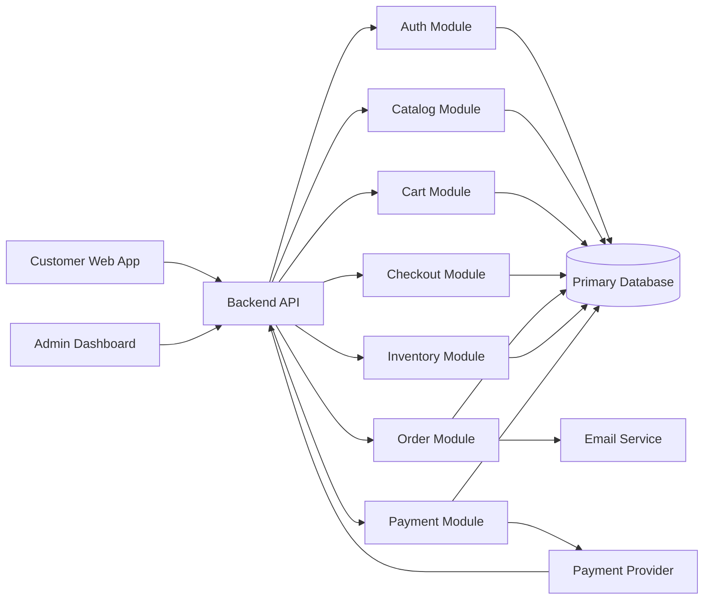
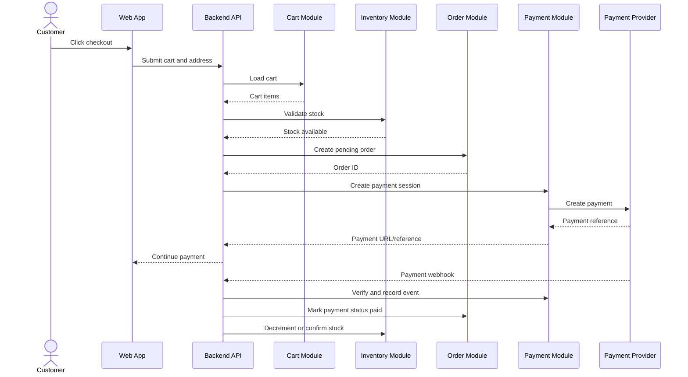
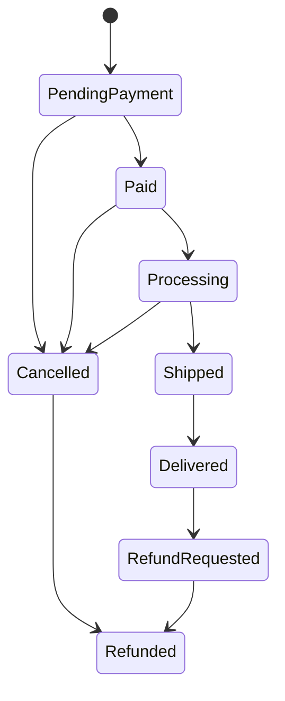

# E-Commerce System Design

## Recommended Architecture

Start with a modular monolith.

That means one deployable backend application, one database, and clear internal modules. This is the best starting point because the domain has many connected workflows: cart, checkout, payment, order, and inventory all need strong consistency early on.

Avoid microservices at the beginning. They add distributed transactions, network failure, deployment complexity, observability overhead, and data consistency problems before the product has enough scale to justify them.

## High-Level Architecture

The customer and admin apps call the backend API. The backend is organized into modules by business responsibility. All modules share one primary database at the start. The payment provider sends webhooks back to the backend, and the order module can trigger email notifications.

## Module Responsibilities

### Auth Module

- Registration and login.
- Password hashing.
- Sessions or JWT handling.
- Role-based access control.

### Catalog Module

- Products.
- Product variants.
- Categories.
- Images.
- Search and filters.

### Cart Module

- Customer cart.
- Cart items.
- Quantity changes.
- Cart validation.

### Checkout Module

- Converts a valid cart into an order.
- Recalculates totals server-side.
- Coordinates inventory and payment.
- Should be thin orchestration, not a place for all business logic.

### Order Module

- Stores order records and order item snapshots.
- Tracks order lifecycle.
- Exposes order history.
- Supports admin fulfillment updates.

### Inventory Module

- Tracks stock per variant.
- Prevents stock from going below zero.
- Handles reservation or decrement logic.

### Payment Module

- Creates payment intent/session with provider.
- Stores payment records.
- Processes webhooks.
- Ensures webhook idempotency.

## Checkout Flow

Important lesson: checkout is not just a form submit. It is a consistency-sensitive workflow where cart prices, stock, order records, and payment events must agree.

## Order State Model

Payment status and fulfillment status should still be stored separately in the database. This diagram is a simplified business view.

## Suggested API Surface

### Customer API

- `POST /auth/register`
- `POST /auth/login`
- `GET /products`
- `GET /products/:id`
- `GET /cart`
- `POST /cart/items`
- `PATCH /cart/items/:id`
- `DELETE /cart/items/:id`
- `POST /checkout`
- `GET /orders`
- `GET /orders/:id`

### Admin API

- `POST /admin/products`
- `PATCH /admin/products/:id`
- `POST /admin/products/:id/variants`
- `PATCH /admin/variants/:id/inventory`
- `GET /admin/orders`
- `GET /admin/orders/:id`
- `PATCH /admin/orders/:id/status`

### Webhook API

- `POST /webhooks/payments`

## Data Consistency Rules

- Never trust cart totals sent by the frontend.
- Order items must store a snapshot of product name, SKU, price, and quantity.
- Payment webhook processing must be idempotent.
- Stock decrement must happen in a database transaction or atomic update.
- Admin deletion should usually mean archive/disable, not hard delete.

## Scaling Path

Start simple:

1. Single backend application.
2. Single relational database.
3. Server-side pagination and indexes.
4. Background jobs only when needed for email, webhooks, and retryable work.

Add complexity later:

- Add cache for product listing only after measuring slow queries.
- Add search engine when database search becomes insufficient.
- Add queue for email, payment retries, and fulfillment events.
- Split services only when module ownership, deployment frequency, or scale clearly requires it.

